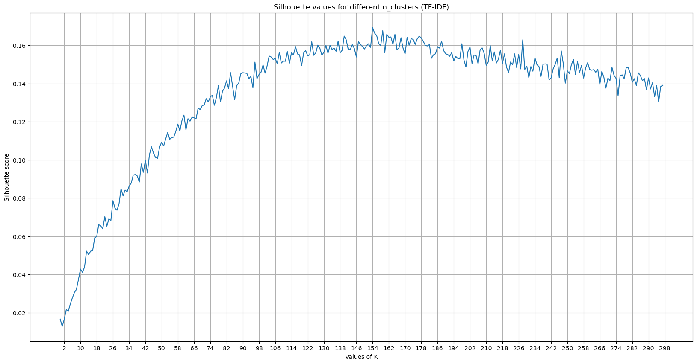
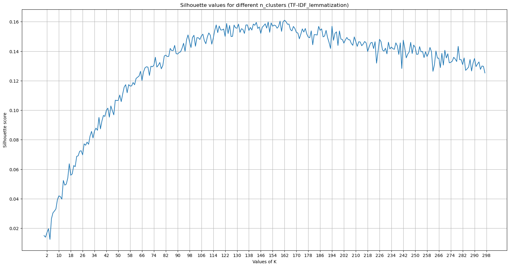
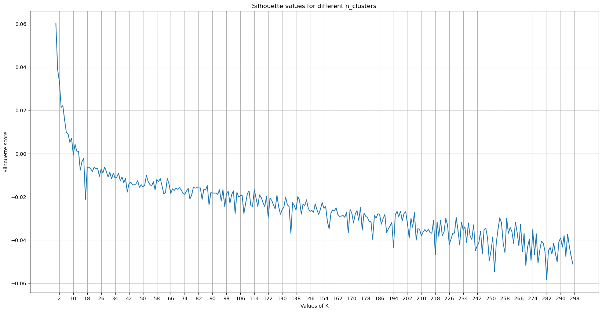

## Jupyter notebooks Containing all the experiments

In this folder we are having 5 different notebooks

```
1.data_analysis_preprocessing.ipynb
2.clustering_on_tfidf.ipynb
3.clustering_on_tfidf_lemmatization.ipynb
4.training-wordvec-on-amazon-reviews-dataset.ipynb
5.clustering_on_Word2Vec.ipynb
```

## Dataset
To train the Word2Vec, I used amazon reviews dataset. The detail you can get in the `4.training-wordvec-on-amazon-reviews-dataset.ipynb`.

## Preprocessing
### For TF-IDF we used Preprocessing as
```
1. Begin by removing the html tags (if any).
2. Remove any punctuations or limited set of special characters like `,` or `.` or `#` etc.
3. Check if the word is made up of English letters.
4. Changing the whole corpus into lowercase.
    [NOTE: But there are a few acronyms also used. So, we can treate it as an hyperparameter. means whether to change into lowercase or not.]
5. Remove stopwords.
6. Finally WordNetLemmatizer is used to get root word (NOTE: Stemming is faster than Lemmatization)
```

### For Word2Vec
```
Used gensim package to preprocess the dataset. You can get the detail in the "5.clustering_on_Word2Vec.ipynb".
```

## Feature Extraction
- I used TF-IDF with `n_grams=(1,3)`
- As TF-IDF is having large no.of feautures. So, in order to reduce the dimentionality of the dataset I used LSA(Latent Semantic Analysis) on `100` features.
- I also trained Word2Vec on amazon reviews dataset and fine-tuned on our own dataset. (Unfortunately that didn't work well. But, there are a lot to explore)

## Models
After having a lot of research about clustering algorithms. I came to conclusion to use `MiniBatchKMeans` and `community_detection` from `sentence_transformers`.

## Metrics
- I used `Silhouette Coefficient` to judge the clusters, as we are not having any labels available to validate the cluster.

## Analysis
- To analyze the cluster we have plotted data in `3D` using `PCA`.
- We have also showed `Top terms(words)` per cluster.

## Result
### MiniBatchKMeans clustering on TF-IDF
#### Silhouette Coefficient score


- We found the best `K` according to `Silhouette score` is `156`.
- Silhouette Coefficient for best K : `0.161507845451339`

### MiniBatchKMeans clustering on TF-IDF lemmatized
#### Silhouette Coefficient score


- We found the best `K` according to `Silhouette score` is `164`.
- Silhouette Coefficient for best K : `0.1612734705760831`

### MiniBatchKMeans clustering on Word2Vec
#### Silhouette Coefficient score


- We found the best `K` according to `Silhouette score` is `2`.
- Silhouette Coefficient for best K : `0.06285892470737756`
- It performed extremely poor as according to `Silhouette Coefficient` score.


## Conclustion
- Best found model is `MiniBatchKMeans` with non-lemmatized dataset.


